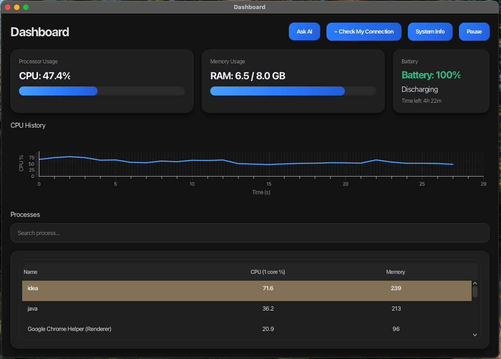

# macOS Monitor

## Screenshot



`macOS Monitor` is a JavaFX desktop app for watching basic macOS system activity in real time. It shows CPU usage, RAM usage, battery state, top processes, network details, and a small diagnostic assistant that can explain a problem using either OpenAI or local fallback rules.

## What it does

- Refreshes CPU, memory, battery, and top process data every second
- Draws a live CPU chart
- Highlights the busiest process in the table
- Lets you search processes by name
- Opens a details window for a process on double click
- Shows extra system information such as OS, uptime, and disk usage
- Checks current network activity, interface, ping, SSID, IP address, and active connections
- Includes an AI diagnostic window for questions like slow performance, battery drain, memory pressure, or network issues
- Falls back to an on-device rule-based assistant if `OPENAI_API_KEY` is not set

## Tech stack

- Java 25
- JavaFX 21
- Maven
- OSHI for system metrics
- OpenAI Responses API for optional AI analysis

## Requirements

- macOS
- JDK 25
- Maven, or just the included Maven wrapper

This project is macOS-focused. Parts of the network logic use macOS-specific tools such as the `airport` utility path.

## Run locally

Using the Maven wrapper:

```bash
./mvnw clean javafx:run
```

Using local Maven:

```bash
mvn clean javafx:run
```

## Optional AI setup

Set an API key if you want the assistant window to use OpenAI:

```bash
export OPENAI_API_KEY=your_api_key_here
```

You can also override the model:

```bash
export OPENAI_MODEL=gpt-5
```

If no API key is present, the app still works and the assistant uses local diagnostic rules instead.

## Main screens

- Dashboard: live CPU, RAM, battery, chart, and top processes
- System Info: CPU name, OS version, RAM totals, uptime, and disk space
- Check My Connection: network speed snapshot and connection details
- AI Diagnostic Assistant: takes a user concern and explains the likely cause using a captured system snapshot


## Notes

- Metrics refresh every second on the main dashboard
- CPU and RAM warnings are shown when usage stays high
- Network speed is estimated by sampling transferred bytes over about one second
- Process data is limited to the top 10 CPU-heavy processes
- There are currently no test files in the project

## Packaging

To build the project:

```bash
./mvnw clean package
```
